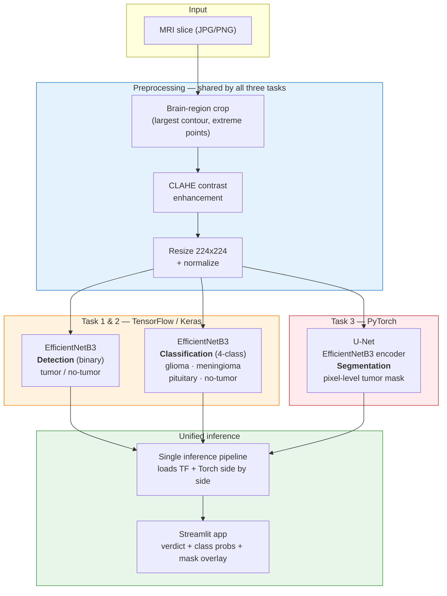

# Brain Tumor Detection, Classification & Segmentation from MRI

[](https://www.python.org/)
[](https://www.tensorflow.org/)
[](https://pytorch.org/)
[](https://streamlit.io/)
[](LICENSE)

A **single pipeline that answers all three clinical questions about a brain MRI slice** — *is there a tumor?*, *what kind?*, and *where exactly?* — instead of the three disconnected models most published work stops at. Hybrid TensorFlow + PyTorch, served behind one Streamlit app.

> **Status: detection & classification trained and evaluated end-to-end. Segmentation trains and infers, but is currently supervised by Otsu-derived pseudo-masks — its Dice score is reported as a *pipeline-validity* number, not a clinical one.** Improving segmentation supervision is the next milestone (see [Roadmap](#roadmap)).

---

## Architecture



Two frameworks coexist in one process on purpose: **TensorFlow owns classification** (mature Keras transfer-learning callbacks, `class_weight` support) and **PyTorch owns segmentation** (`segmentation-models-pytorch` gives a battle-tested U-Net with any timm encoder). A GPU-setup utility runs *before* either library is imported so both can share the device without one grabbing all VRAM.

---

## The problem

Brain tumors are graded I–IV by the WHO; high-grade glioblastoma carries a median survival under a year, so the diagnostic window is narrow. In practice a radiologist reads every slice by hand, and the accuracy of that read depends on their time and experience.

Deep learning has been applied to this for years — but almost always **one task at a time**. A classifier tells you *glioma* and stops. A segmenter outlines a region and never says what it is. A clinician looking at the output of either one still has to go get the other. That fragmentation is the gap this project targets:

**One preprocessing pass, three heads, one answer.** Detection gives the triage decision, classification gives the tumor type, segmentation gives the spatial extent — from the same input, in the same call.

---

## How it works

| Stage | What happens |
| --- | --- |
| **Preprocessing** | Every slice is cropped to the brain region using the largest external contour and its extreme points (kills the black border that otherwise dominates the input), enhanced with **CLAHE** so the tumor boundary separates from surrounding tissue, then resized to **224×224** and normalized. Identical for all three tasks, so nothing is task-specific until the head. |
| **Detection (TF)** | EfficientNetB3, ImageNet-pretrained, dropout 0.4, sigmoid head. Trained **freeze-then-fine-tune**: 5 warm-up epochs with the backbone frozen so the fresh head doesn't wreck pretrained features, then up to 64 fine-tune epochs end-to-end. `EarlyStopping` monitors **recall**, not accuracy — a missed tumor costs far more than a false alarm. |
| **Classification (TF)** | Same backbone and schedule, 4-way softmax head. Class imbalance handled with `sklearn.compute_class_weight('balanced')` rather than resampling, so no image is duplicated or dropped. Adam at `lr=1e-4`, weight decay `1e-5`, mixed precision (FP16), `ReduceLROnPlateau` (factor 0.5, patience 4), `EarlyStopping` (patience 8 on `val_accuracy`). |
| **Segmentation (PyTorch)** | U-Net with an ImageNet-pretrained **EfficientNetB3 encoder** and a 5-stage decoder `[256, 128, 64, 32, 16]`; a 1×1 conv emits a single-channel logit map. Loss is **`0.6 × Dice + 0.4 × BCE-with-logits`** — Dice optimizes region overlap directly (the right objective when tumor pixels are a small minority), BCE keeps dense per-pixel gradients flowing early in training when Dice is nearly flat. 32 epochs, Adam `lr=1e-4`, cosine-annealing LR, `torch.cuda.amp`, custom early stopping on validation loss. |
| **Inference** | One pipeline loads all three checkpoints, runs the shared preprocessing once, and returns the binary verdict, the 4-class probability vector, and the mask overlay together. The Streamlit app is a thin wrapper over it. |

The three tasks are **decoupled at training time and unified only at inference** — each can be retrained, swapped, or re-tuned without touching the others.

---

## Dataset

Kaggle **Brain Tumor MRI Dataset** — ~7,200 T1-weighted contrast-enhanced slices across four classes, near-balanced by design.

| Class | Train | Test |
| --- | --- | --- |
| glioma | ~1,400 | ~400 |
| meningioma | ~1,400 | ~400 |
| pituitary | ~1,400 | ~400 |
| notumor | ~1,400 | ~400 |
| **Total** | **~5,600** | **~1,600** |

Expected on-disk layout:

```
Dataset/                 # or data/raw/ — the loader tries data/raw first, then falls back
├── Training/
│   ├── glioma/  meningioma/  notumor/  pituitary/
└── Testing/
    ├── glioma/  meningioma/  notumor/  pituitary/
```

Detection labels are derived by collapsing the three tumor classes into a single positive class against `notumor`.

**The dataset ships no expert tumor masks.** This single fact drives the biggest caveat in this repo — see [Honest limitations](#honest-limitations).

---

## Results

Run `python -m src.evaluation.evaluate_all --config configs/config.yaml` to regenerate every number below.

### Task 1 — Detection (binary)

| Metric | Value |
| --- | --- |
| Accuracy | `TBD` |
| **Recall (sensitivity)** | `TBD` |
| Precision | `TBD` |
| Specificity | `TBD` |
| F1 | `TBD` |
| AUC-ROC | `TBD` |

Recall is the headline number here, not accuracy. A screening-adjacent model that trades a few false positives for fewer missed tumors is the correct trade-off, and the training loop is tuned for it (early stopping monitors validation recall).

### Task 2 — Classification (4-class)

| Metric | Value |
| --- | --- |
| Accuracy | `TBD` |
| Macro F1 | `TBD` |
| Weighted F1 | `TBD` |

| Class | Precision | Recall | F1 |
| --- | --- | --- | --- |
| glioma | `TBD` | `TBD` | `TBD` |
| meningioma | `TBD` | `TBD` | `TBD` |
| pituitary | `TBD` | `TBD` | `TBD` |
| notumor | `TBD` | `TBD` | `TBD` |

Read the **confusion matrix**, not just the headline accuracy — glioma↔meningioma is the known hard pair on this dataset, and that's where the interesting errors live. Full discussion in [`docs/FINDINGS.md`](docs/FINDINGS.md).

### Task 3 — Segmentation

| Metric | Value | Supervision |
| --- | --- | --- |
| Dice (DSC) | `TBD` | Otsu pseudo-masks |
| IoU (Jaccard) | `TBD` | Otsu pseudo-masks |

> **Read this number carefully.** Because no expert masks exist for this dataset, the U-Net is supervised by **pseudo-masks generated with Otsu thresholding**. A high Dice therefore means *the network faithfully reproduces a thresholding heuristic* — it is a **pipeline-validity metric, not a measure of clinical segmentation accuracy**. It says the architecture, loss, and training loop work. It does not say the outlines are correct. Full reasoning in [`docs/FINDINGS.md`](docs/FINDINGS.md).

---

## Honest limitations

- **Segmentation ground truth is synthetic.** Otsu-derived pseudo-masks are an intensity heuristic. They over-segment bright non-tumor structures (skull remnants, ventricles, enhancement artifacts) and under-segment low-contrast infiltrative margins. Dice against them is an upper bound on *agreement with Otsu*, not on clinical correctness. This is the single largest gap in the project and is deliberately scoped as the next milestone.
- **2D slices, not volumes.** The dataset is per-slice. Real neuro-oncology reads are volumetric (3D context, multiple sequences: T1, T1-CE, T2, FLAIR). A 2D single-sequence model cannot capture through-plane extent.
- **No external validation.** Train and test come from the same Kaggle collection, same acquisition distribution. Reported numbers are almost certainly optimistic relative to a different scanner, site, or protocol.
- **Detection is derived, not native.** Binary labels come from collapsing the class labels, so detection inherits any labeling noise in the 4-class annotations.
- **Not a medical device.** Research and educational code. Nothing here is validated, cleared, or intended for clinical decision-making.

Naming these is the point. A pipeline that reports Dice without the pseudo-mask caveat is reporting a number that doesn't mean what it appears to mean.

---

## Repository structure

```
Brain-Tumor-Detection-and-Segmentation-/
├── app/
│   └── streamlit_app.py          # Clinical demo UI over the unified pipeline
├── configs/
│   └── config.yaml               # Single source of truth: paths, hyperparams, metrics
├── data/                         # raw / processed / masks (gitignored)
├── Dataset/                      # Fallback location for the Kaggle download
├── notebooks/                    # EDA + demo notebooks
├── src/
│   ├── data/                     # Preprocessing (crop, CLAHE, normalize) + tf.data / Dataset pipelines
│   ├── models/                   # EfficientNetB3 (TF) and U-Net (PyTorch) definitions
│   ├── training/
│   │   ├── train_tf_detection.py
│   │   ├── train_tf_classification.py
│   │   └── train_torch_segmentation.py
│   ├── evaluation/
│   │   └── evaluate_all.py       # Every metric in the Results section
│   ├── inference/                # Unified TF + Torch inference pipeline
│   └── utils/                    # GPU setup, checkpointing, visualization
├── docs/
│   └── FINDINGS.md               # Methodology, design rationale, and what the numbers mean
├── requirements.txt
└── README.md
```

---

## Quick start

```bash
git clone https://github.com/Mounika-Reddy-0802/Brain-Tumor-Detection-and-Segmentation-.git
cd Brain-Tumor-Detection-and-Segmentation-

python -m venv .venv && source .venv/bin/activate    # Windows: .venv\Scripts\activate
pip install -r requirements.txt
```

Download the Kaggle *Brain Tumor MRI Dataset* and place it at `data/raw/` (or `Dataset/`) using the layout in [Dataset](#dataset).

### Train

Order matters only in that evaluation expects all three checkpoints:

```bash
python -m src.training.train_tf_detection      --config configs/config.yaml
python -m src.training.train_tf_classification --config configs/config.yaml
python -m src.training.train_torch_segmentation --config configs/config.yaml
```

### Evaluate

```bash
python -m src.evaluation.evaluate_all --config configs/config.yaml
```

Prints accuracy, precision/recall/F1 (per-class and aggregated), AUC-ROC, Dice, and IoU — the source for every number in [Results](#results).

### Run the app

```bash
streamlit run app/streamlit_app.py
```

Upload an MRI slice → get the binary verdict, the 4-class probability breakdown, and the segmentation overlay in one pass.

### Notes

- **Run the GPU-setup utility before importing models.** TensorFlow grabs all VRAM by default; the util enables memory growth so PyTorch can coexist in the same process.
- CPU-only works but training is slow — plan on a GPU (Colab's free T4 is sufficient) for the full sequence.
- Segmentation falls back to pseudo-masks automatically when no expert masks are found under `data/masks/`.

---

## Roadmap

| Milestone | Status |
| --- | --- |
| Shared preprocessing pipeline (crop + CLAHE + normalize) | ✅ Done |
| EfficientNetB3 detection, recall-optimized | ✅ Done |
| EfficientNetB3 4-class classification, class-weighted | ✅ Done |
| U-Net segmentation, Dice+BCE, pseudo-mask supervision | ✅ Done |
| Unified inference pipeline + Streamlit app | ✅ Done |
| Full evaluation harness (`evaluate_all`) | ✅ Done |
| **Real segmentation supervision** — BraTS-style expert masks, or weak supervision from Grad-CAM/CAM seeds instead of raw Otsu | 🔜 Next |
| Explainability: Grad-CAM overlays on the classifier to show *why* a class was predicted | 🔜 Next |
| Test-time augmentation + calibration (temperature scaling) for trustworthy probabilities | 📋 Planned |
| External validation on a second, independently-sourced dataset | 📋 Planned |

---

## Documentation

- [`docs/FINDINGS.md`](docs/FINDINGS.md) — full methodology, every design decision and why it was made, what each metric does and does not prove, error analysis, and the segmentation-supervision problem in detail.

## Tech stack

`Python` · `TensorFlow/Keras` · `PyTorch` · `segmentation-models-pytorch` · `EfficientNetB3` · `U-Net` · `scikit-learn` · `OpenCV` · `NumPy` · `Streamlit`

## License

MIT — see [`LICENSE`](LICENSE).

## Disclaimer

Research and educational project. **Not a medical device.** Not validated for clinical use, and no output from this system should inform patient care.